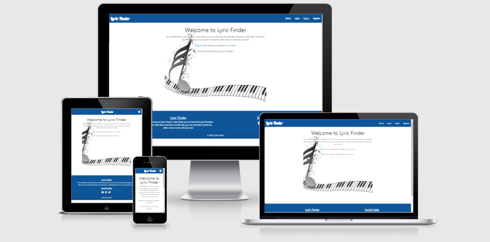
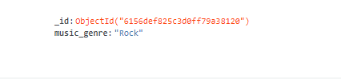
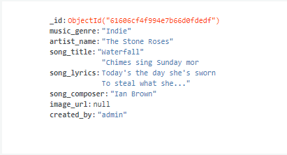
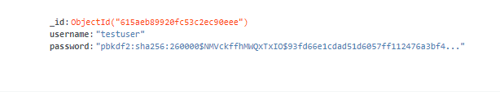

# Lyric Fnder

[You can visit the live site here](https://lyric-finder-jw.herokuapp.com/)

## Table of Contents
> 1. [Target Audience](#target-audience)
> 2. [Project Goals](#project-goals)
> 3. [The 5 Planes of UX](#the-5-planes-of-ux)  
    3.1 [Strategy](#strategy)  
    3.2 [Scope](#scope)  
          - i [User Stories](#user-stories)   
          - ii  [Site Owner Goals](#site-owner-goals)    
    3.3 [Structure](#structure)  
    3.4 [Skeleton](#skeleton)  
          - i [Wireframes](#wireframes)  
          - ii [Desktop](#desktop)  
          - iii [Mobile](#mobile)  
    3.5 [Surface](#surface)  
          - i [Colours](#colours)  
          - ii [Typography](#typography)  
          - iii [Database](#database)
> 4. [Features](#features)  
> 5. [Technolgies Used](#technolgies-used)
> 6. [Testing](#testing)  
>   6.1 [Code Validation](#code-validation)  
    6.2 [Device Tests](#device-tests)  
    6.3 [Browser Tests](#browser-tests)  
    6.4 [User Story Tests](#user-story-tests)  
> 7. [Bugs Fixes](#bugs)
> 8. [Deployment](#deployment)
> 10. [Credits](#credits)
> 11. [Acknowledgements](#acknowledgements)

## Target Audience
The audience ideally targerted are music lovers who enjoy finding out the lyrics to their favourite songs. 
On this site they will be view existing lyrics, as well as add and edit their own lyrics.

# The 5 Planes of UX
## Strategy
## Project Goals - Delete?
---
The primary business goals of this site are:
> * To promote the island of Santorini
> * Increase the number of vistors to the island
> * Provide inspiration for Santorini as a holiday destination

The primary cusomter goals of this site are:
> * Learn more about the island before visting
> * Contact the site owner with any additional questions or queries
> * Be inspired to choose Santorini as a viable holiday destination

## Scope
## User Stories
As a new or returning visitor I would like to see:
> 1. A site that is easy and clear to navigate.
> 2. External social media links.
> 3. A site that responds and provides feedback on my interactions.
> 4. A site that I can interact with.
> 5. As a user I would like to see a responsive site that can be used on mobile devices.
> 6. An error page to show if I have enterted an incorrect URL.
> 7. The ability to edit and delete lyrics added by the user.
> 8. A site that has clear login and registration pages.

## Site owner goals
The main goal of this site is to present song lyrics on a website that is easy to navigate.
> 9. A way of contact the site owner with any issues related to the site.
> 10. Present the end user with a clear and simple navigaion menu.
> 11. The ability to add, edit and delete lyrics.
> 12. Make a site that is responsive across all devices.
> 13. A site that provides feedback and validation.
> 14. On the 404 page the user shouldn't use the broswer back but instead the nav bar.
---

## Structure
The website is made up of 8 web pages. Each page is cleary designed, easy to navigate, and with well layed out information. With a mobile first approach in mind I have used bootstrap throughout to make the site respoinsive on mobile devices.

> The 8 pages are:
> 1. Home Page: A welcome brieft welcome message greets the user, a link for new users to register and a link for existing users to login.
> 2. Login Page: A page where users can login - with a link to register a new account
> 3. Register Page: Where new users can register for the first time - with a a link for existing users to login.
> 4. Lyrics Page: 6 cards have already been added with a selection of lyrics from different musical genres displayed. Also loggeed in users can can add, edit and delete they have added.
> 5. Profile Page: A profile page that the display the name of the users logged in and a link to add lyrics.
> 6. New Lyrics Page: A form where a user can add their own lyrics to the site.
> 7. Manage Genre Page: For admin users only who can add, edit or delate music genres
> 8. 404: This alerts users if they have entered an incorrect URL for the site. The user is presented with warning message, navbar and footer.
---

## Skeleton
To design and develop the wireframes I first used Balsamiq, then used Snipping Tools to create PNG versions. The wireframes images are designed to collaspe.

## Wireframes
>
### Desktop
> 

Log In

> 
>

>
> 

Home Page

> 
> 

> 
> 

Lyrics Page

> 
> 

>
> 

Profile Page

> 
> 

>
> 

New Lyrics

> 
> 

>
> 

Manage Genres

> 
> 

>
> 

Log Out

> 
> 

>
### Mobile
> 

Log In

> 
>

>
> 

Home Page

> 
> 

> 
> 

Lyrics Page

> 
> 

>
> 

Profile Page

> 
> 

>
> 

New Lyrics

> 
> 

>
> 

Manage Genres

> 
> 

>
> 

Log Out

> 
> 

---

## Surface
## Colours - Change for MS3
Each page is design with very simple colours and images to showcase the island. The colours I have used are as follows:
> - #FFCC51 - used as a background color for the footer and navbar
> - #050505 - used for the site brand and nav links
> - #009688 - used to style the quiz text.

## Typography
For the brand logo I have used Google Font - Lobster, and for the Lyrics (flow-test) I have used Google Font - Roboto Condensed. Everywhere else I have used the default Materialize font.

## Database
> For the database I have useed MongoDB. The database is made up of 3 collections;
- Genre
- Lyrics
- Users

### Genre

I have stored the different style of music using the 'genre' keyword, as this allow the user to select musical genres from a select dropdown list. 

### Lyrics

Any lyrics that the user adds through the application will be stored in the database, this data can will be pulled from the database and displayed on the Lyrics page.

### Users

The usernames and password are stored in the database as this allows the users to log in/log out securely.

# Features
## Existing Features
### Features found throughout the site
- The site is fully responsive on all screen sizes.
- Nav and footer present and consistent on all pages. The footer is designed to stay at the bottom of each page regardless of content.
- Each page has its own custom header relevant to the content on the page.
- Flash messages are displayed when the user performs and action such as logging out or addding lyrics to the site etc.

### Home Page
- The homepage consists of a background image with a musical theme in keeping with the sites overall subject.
- An introductory message is also displayed to greet the user.

### Lyrics Page
- A search bar is present at the very top of the page allowing users to search existing lyrics.
- To dislay the lyrics I have used Materialize card classes with each card being the same size. The front side of the card shows a picture of the band, artist name, music genre, composer and the user the lyrics were added by. Clicking on the fontawesome plus button reveals the song title and also the lyrics of the song.
- There are two button present (only visible to admins or the user who has added the lyrics) to delete and or edit the lyrics.

### Profile Page
- The profile page displays the current users name and Materilize card with a link on it to add lyrics.

### New Lyrics Page
- A form is diplayed made up of 6 input field; Choose Genre (a select dropdown list), artist name, song title, song lyrics, song composer and add album artwork.
- Each input field is a required element, with form validation not allowing the users to skip a field without first completing it.
- Finally, an add lyrics button which submits the lyrics to the database. A flash message is displayed confirming this.

### Manage Genres Page
- The Manage Genres page is only visible to site admins whereby they can add, edit or even delete genres from the database.
- Once again I have used simple Materialize cards to display any genres that have already been or will be added tot the site.
 
### Log In
- A simple form with two fields is displayed; username and password.
- 
- If a new user visits the site a link is display for that user to reigster a new account via the Register Page.

### Register Page
- A simple form with two fields is displayed; username and password.
- If the users is already resgistered there is a link display to redirect back to the Log In page.

### 404 Error Page
- 404 error page for when a user enters a incorrect URL
---

## Technolgies Used
> * HTML5
> * CSS3
> * Javascript
> * MongoDB
> * Balsamiq

## Testing
## Code Validation
### CSS Validation
I have used the W3C CSS Validation Service - Jigsaw to check that my CSS is valid

|    Page     |               Result                |                       Screenshot                       |
| :---------: | :---------------------------------: | :----------------------------------------------------: |
| Entire Site | CSS Validation passed with 0 Errors | [View Results](docs/Validation/CSS/CSS_Validation.PNG) |
---

### HTML Validation
I have used the W3C Markup Validation Service to check my HTML is valid

|   Page         |  Result              |                      Screenshot                      |
|:--------------:|:--------------------:|:----------------------------------------------------:|
|   Home         | 0 errors             | [View Results](docs/Validation/HTML/Home.PNG)        |
|   Lyrics       | 0 errors             | [View Results](docs/Validation/HTML/Lyrics.PNG)      |
|   New Lyrics   | 0 errors             | [View Results](docs/Validation/HTML/New_Lyrics.PNG)  |
|   Manage Genres| 0 errors             | [View Results](docs/Validation/HTML/Genres.PNG)      |
|   Register     | 0 errors             | [View Results](docs/Validation/HTML/Register.PNG)    |
|   Log In       | 0 errors             | [View Results](docs/Validation/HTML/Log_In.PNG)      |
|   Entire Site  | 0 errors             | [View Results](docs/Validation/HTML/Entire_Site.PNG) |
---

### Javascript Validation
I have used JS Hint to validate my Javascript.

|     Page     |        Result        |                         Screenshot                          |
|:------------:|:--------------------:|:-----------------------------------------------------------:|
|    script.js   | 0 errors, 0 warnings | [View Results](docs/Validation/Javascript/script.js.PNG)  |
---

### Python
I have used PEP8 Online to check of my Ptyhon code is valid or not.

|     Page     |   Result |                         Screenshot                |
|:------------:|:--------:|:-------------------------------------------------:|
|    app.py    | 0 errors | [View Results](docs/Validation/Python/app.py.PNG) |

### WAVE Accessibilty - Does this need to be done for MS3?
I have used the WAVE Web Accessibilty Evaluation Tool to ensure site is accessible

|   Page  |            Result           | Screenshot |
|:-------:|:---------------------------:|:----------:                                                                 
|   Home    | 0 errors, 0 contrast errors | [View results](/docs/WAVE-Accessibilty/index.html_Wave_Validation.PNG)      |
|   Lyrics  | 0 errors, 0 contrast errors | [View results](/docs/WAVE-Accessibilty/quiz.html_Wave_Validation.PNG)       |
|   Profile | 0 errors, 0 contrast errors | [View results](assets/docs/WAVE-Accessibilty/quiz.html_Wave_Validation.PNG) |
| New Lyrics | 0 errors, 0 contrast errors | [View results](assets/docs/WAVE-Accessibilty/quiz.html_Wave_Validation.PNG) |
| Manage Genres | 0 errors, 0 contrast errors | [View results](assets/docs/WAVE-Accessibilty/quiz.html_Wave_Validation.PNG) |
| Log In | 0 errors, 0 contrast errors | [View results](assets/docs/WAVE-Accessibilty/quiz.html_Wave_Validation.PNG) |

--- 

### Lighthouse Performance - Does this need to be done for MS3?
I have used Google Lighthouse (in Google Dev tools) to measure the performance the site

|       Page           |                            Result                            |                        Screenshot                        |
| :------------------: | :----------------------------------------------------------: | :------------------------------------------------------: |
|  Home (Desktop)      | 97 Performance, 95 Accessibility, 87 Best Practices, 100 SEO |  [View Results](docs/Lighthouse/Desktop/index.html.PNG)  |
|  Lyrics (Desktop)    | 99 Performance, 96 Accessibility, 93 Best Practices, 100 SEO |  [View Results](docs/Lighthouse/Desktop/quiz.html.PNG)   |
| New Lyrics (Desktop) | 99 Performance, 96 Accessibility, 93 Best Practices, 100 SEO | [View Results](docs/Lighthouse/Desktop/contact.html.PNG) |
|   Home (Mobile)   | 77 Performance, 97 Accessibility, 87 Best Practices, 100 SEO |  [View Results](docs/Lighthouse/Mobile/index.html.PNG)   |
|   Quiz (Mobile)   | 84 Performance, 97 Accessibility, 93 Best Practices, 100 SEO |   [View Results](docs/Lighthouse/Mobile/quiz.html.PNG)   |
| Contact (Mobile)  | 88 Performance, 97 Accessibility, 93 Best Practices, 100 SEO | [View Results](docs/Lighthouse/Mobile/contact.html.PNG)  |
--- 

### Device Tests
The site has been tested on the following physical devices
> - Huawei P30 Pro
> - HP Envy 17 Laptop
> - Samsung Galaxy A31

Actual tests:
> 1. Home, Lryics, Profile, New Lyrics, Manage Genres nav links all go to the correct pages. Clicking the Lyric Finder brand logo navigates back to the Home page from each page.
> 2. On a mobile device the nav bar collapses to a hamburger button. When clicked a sidenav appears, all links work here too and the Lyric Finder brand logo navigates to home when clicked.
> 3. The search function on the Lyrics pages return results on lyrics, artist name, music genre, composer as intended. A flash message appears if no results can be found. The reset button clears search results.
> 4. The text and images are all clearly displayed.
> 5. All pages are responsive.
> 6. When clicking on each page the nav bar hover colour changes.
> 7. A 404 error page will be displayed in the event of a incorrect URL being entered. The standard nav can be used to navigate back to the site pages.
> 8. The three social links for Facebook, Instgram and Twitter all navigate to respective sites home pages and also open in a new tab.
Overall results:
> * The above physical tests passed on each device they were tested on.

### Browser Tests
> * Firefox Developer Edition - All nav links, features and website work as expected
> * Google Chrome - All nav links, features and website work as expected
> * Firefox Developer Edition - All nav links, features and website work as expected

### User story tests - Does this need to be done for MS3?
> 1. A site that is easy and clear to navigate

|                    Feature                    |             Test Steps             |           Expected            |       Actual       |
| :-------------------------------------------: | :--------------------------------: | :---------------------------: | :----------------: |
| A website that is easy and clear to navigate. | Clicked on nav links for each page | Pages to load when clicked on | Works as expected |

[User story screenshot](docs/Features/homepage.PNG)  

> 2. A map of where Santorini is located

|                   Feature                    |                          Test Steps                          |    Expected    |      Actual       |
| :------------------------------------------: | :----------------------------------------------------------: | :------------: | :---------------: |
| Display a map of where Santorini is located. | Navigate to home page where is map is clearly and prominently displayed | Map to display | Works as expected |  

[User story screen shot](docs/Features/homepage.PNG)  

> 3. The current weather conditions in Santorini

|                           Feature                           |       Test Steps        |               Expected                |      Actual       |
| :---------------------------------------------------------: | :---------------------: | :-----------------------------------: | :---------------: |
|       Display current weather conditions in Santorini       | Navigate to home page.  |       Weather Widget to display       | Works as expected |
| More detailed weahter forecast for the next 24hr and 7 days | Click on Weather Widget | Pass through to Forecast7.com website | Works as expected |

[User story screen shot](docs/Features/weatherwidgettest.PNG)

> 4. External social media links to find out more about the island

|                Feature                 |                          Test Steps                          |               Expected                |      Actual       |
| :------------------------------------: | :----------------------------------------------------------: | :-----------------------------------: | :---------------: |
| Social media links to external content | Click on Youtube and Tripadvisor social media links display in footer | Youtube Video and Tripadvisor to load | Works as expected |

> 5. An informative quiz where I can test my knowledge on Santorini

|                         Feature                         |                     Test Steps                      |           Expected            |      Actual       |
| :-----------------------------------------------------: | :-------------------------------------------------: | :---------------------------: | :---------------: |
| Find an informative quiz to test knowledge on Santorini | Navigate to quiz page, clicked on Start Quiz button | Quiz to start as question one | Works as expected |

[User story screen shot](docs/Features/quiztest.PNG)  

> 6. Feedback on which answers I have got right

|             Feature              |          Test Steps           |             Expected             |      Actual       |
| :------------------------------: | :---------------------------: | :------------------------------: | :---------------: |
| Show feedback on correct answers | Answered a question correctky | Correct answer to be highlighted | Works as expected |

[User story screen shot](docs/Features/right_wrong_answer.PNG)  

> 7. A final page that displays how well did on the quiz

|                  Feature                   |   Test Steps   |               Expected               |      Actual       |
| :----------------------------------------: | :------------: | :----------------------------------: | :---------------: |
| Display overall summay page at end of quiz | Completed quiz | Overall quiz summary to be displayed | Works as expected |

[User story screen shot](docs/Features/quiz_result.PNG)

> 8. An option to close out of the final page or play quiz again

|                    Feature                     |   Test Steps   |                    Expected                     |      Actual       |
| :--------------------------------------------: | :------------: | :---------------------------------------------: | :---------------: |
| Buttons to close out of quiz or start it again | Completed quiz | 'Try again' and 'Go to home' buttons to display | Works as expected |

[User story screen shot](docs/Features/endofquizbuttons.PNG)  

> 9. A contact page to get in touch with the site owner

|                   Feature                   |      Test Steps      |             Expected             |      Actual       |
| :-----------------------------------------: | :------------------: | :------------------------------: | :---------------: |
| Contact page for user to contact site owner | Clicked on quiz page | Contact form page to be displyed | Works as expected |

[User story screen shot](docs/Features/contactpage.PNG) 

> 10. A site that responds and provides feedback on my interactions

|                       Feature                       |             Test Steps              |                           Expected                           |      Actual       |
| :-------------------------------------------------: | :---------------------------------: | :----------------------------------------------------------: | :---------------: |
| Features that respond and provide feed back to user | Completed contact form, played quiz | User validation displyed on contact form. User progress on quiz displayed | Works as expected |

[User story screen shot](docs/Features/examplesofvalidation.PNG) 

> 11. A site that I can interact with

|              Feature              |               Test Steps                |                       Expected                       |      Actual       |
| :-------------------------------: | :-------------------------------------: | :--------------------------------------------------: | :---------------: |
| Interactive features on webs site | User can complete contact form and quiz | Contact form and quiz page for user to interact with | Works as expected |  

[User story screen shot](docs/Features/interactivefeatures.PNG)

> 12. As a user I would like to see a responsive site that can be used on mobile devices

|                   Feature                   |          Test Steps          |                           Expected                           |      Actual       |
| :-----------------------------------------: | :--------------------------: | :----------------------------------------------------------: | :---------------: |
| A site that is responsive on mobile devices | View site from mobile device | Site is responsive. Nav bar collapses to burger menu. Test each link. | Works as expected |

[User story screen shot](docs/Features/responsiveness.PNG)  

> 13. An error page to show if I have enterted an incorrect URL

|                         Feature                          |     Test Steps      |        Expected        |      Actual       |
| :------------------------------------------------------: | :-----------------: | :--------------------: | :---------------: |
| An error 404 will be displayed if incorrect URL entered. | Enter incorrect URL | Error 404 page to load | Works as expected |  

[User story screen shot](docs/Features/404.PNG)  

> 14. Display a contact form so the user can get in touch with the site owner

|                           Feature                            |        Test Steps         |                Expected                 |      Actual       |
| :----------------------------------------------------------: | :-----------------------: | :-------------------------------------: | :---------------: |
| Contact form for the user to get in touch with site owner with questions or queries | Navigated to contact page | Contact form to display on contact page | Works as expected |  

[User story screen shot](docs/Features/contact.PNG)  

> 15. Present the end user with a clear and simple navigaion menu

|                           Feature                            |                     Test Steps                     |            Expected             |      Actual       |
| :----------------------------------------------------------: | :------------------------------------------------: | :-----------------------------: | :---------------: |
| Present the end user with a clear and simple navigation menu | Loaded site where the nav bar is clearly layed out | Nav bar to display on each page | Works as expected |

[U er story screen shot](docs/Features/navbar.PNG)

> 16. Display the current weather in Santorini

|                       Feature                        |    Test Steps    |                   Expected                    |      Actual       |
| :--------------------------------------------------: | :--------------: | :-------------------------------------------: | :---------------: |
| Weather Widget displays current weather of Santorini | Loaded home page | Weather widget with daily forecast to display | Works as expected |

[User story screen shot](docs/Features/weatherwidget.PNG)

> 17. Provide a quiz where the user can test their knowledge

|                   Feature                    |    Test Steps    |           Expected           |      Actual       |
| :------------------------------------------: | :--------------: | :--------------------------: | :---------------: |
| Quiz page that contains informative question | Loaded quiz page | Quiz to display on page load | Works as expected |

[User story screen shot](docs/Features/quizpage.PNG)

> 18. Make a site that is responsive across all devices.

|                Feature                 |                   Test Steps                   |       Expected        |      Actual       |
| :------------------------------------: | :--------------------------------------------: | :-------------------: | :---------------: |
| Site created with mobile first in mind | Test across different devices (emulators used) | Site to be responsive | Works as expected |

[User story screen shot](docs/Features/deviceresponsivenness-2.png)

> 19. A site that provides feedback and validation.

|                   Feature                   |               Test Steps                |              Expected               |      Actual       |
| :-----------------------------------------: | :-------------------------------------: | :---------------------------------: | :---------------: |
| Site that provides feed back and validation | Completed quiz with provides validation | Validation to provided on questions | Works as expected |

[User story screen shot](docs/Features/right_wrong_answer.PNG)  

> 20. On the 404 page the user shouldn't use the broswer back but instead the nav bar.

|                         Feature                         |                         Test Steps                         |           Expected            |      Actual       |
| :-----------------------------------------------------: | :--------------------------------------------------------: | :---------------------------: | :---------------: |
| 404 page with nav bar for user to navigate back to site | Entered incorrect URL and used nav bar to get back to site | To be directed back main site | Works as expected |

[User story screen shot](docs/Features/404nav.PNG)  

> 21. Display a map of Santorini

|         Feature          |          Test Steps           |         Expected         |      Actual       |
| :----------------------: | :---------------------------: | :----------------------: | :---------------: |
| Display map of Santorini | Map of Santorini on home page | To find map on home page | Works as expected |  

[User story screen shot](docs/Features/map.PNG)  

---

# Bugs - Update for MS£3
> **Bug** Contact form initially didn't push down when using mobile nav  
> **Fix** Changed **poistion: absolute;** to **postion: relative**. Changed **top:50%** to **top:25%**. Changed **transform: translate(-50%,50%);** to **transform: translate(-50%,25%);**
>
> **Bug** Small gap at top of page between bottom of nav bar and top of quiz.  
> **Fix** Changed **margin: 40px auto;** to **margin: auto;** on .custom box CSS class  
>
> **Bug** Content map, heading-left doesn't push down on mobile nav  
> **Fix** Changed **position : absolute;** to **position: relative;** on .hero-text CSS class  

# Deployment - Update for MS3

I have deployed this site to GitHub pages

> 1. Log in to git hub and find the respositry you wish to deploy
> 2. On the respository click on **Settings**
> 3. From left the hand menue click on **Pages**
> 4. Click on the **Source** option
> 5. From the dropdown change **none** to **master branch**
> 6. The deplyment will take a few moments to finalise
> 7. The live site URL is now displayed under Github Pages

Clone site locally

> 1. Log in to Github and navigate to main page of repository
> 2. Click on **Code** above the list of files
> 3. Copy the link under clone to https
> 4. Open Git bash
> 5. If required change the directory to where you would like repo cloned to
> 6. Type git clone and then copy in repo URL
> 7. Press enter and repo will go through short cloning process

---

### Credits
## Images
> * Stone Roses image credited to Pinterest.com - https://i.pinimg.com/originals/17/e6/21/17e6212ef5b95530f2408332959b99f7.jpg
> * The Charlatans image credited to Exeter Phoenix - https://exeterphoenix.org.uk/wp-content/uploads/2021/06/the-charlatans-exeter-phoenix-great-hall.jpg
> * Queens of the Stone Age (QOTSA) image credited to Mesa Press - https://www.mesapress.com/wp-content/uploads/2017/09/Villains-QOTSA.png
> * James Brown image credited to Wallpapercave.com - https://wallpapercave.com/wp/wp2160960.jpg
> * AC/DC image credited to Billboard.com - https://static.billboard.com/files/media/acdc-back-in-black-album-cover-650-compressed.jpg - Billboard
> * Jamiroquai image credited to Genius.com - http://images.genius.com/2d828c0c76c979c0c83ce0beb842282c.500x500x1.jpg

## Lyrics
> * Lyrics to Stone Roses' Waterfall credited to Music Match
> * Lyrics to The Charlatans Crashin' In credited to Song Lyrics
> * Lyrics to Queens of the Stone Age's (QOTSA) No One Knows credited to Music Match
> * Lyrics to James Brown's Super Bad credited to Lyric Find
> * Lyrics to AC/DC's Back in Black credited to Music Match

# Acknowledgements
> * Mo Shami for his external patience and guidance
> * My partner who has not seen that much of me during MS2
